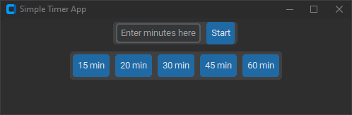

# SimpleTimer
Simple timer app for productivity.

*Warning of flashing lights*
When the countdown is finished, the counter flashes/blinks between grey and white. 

Based on tkinter, customtkinter and time.
Offers predefined values of 15, 20, 30, 45 and 60 minutes and a custom amount.

Known Issues:
 - Background sometimes stays white after the countdown is finished.
   
To Do:
  - Fix background bug
  - Add time accumulative time tracking for each day
